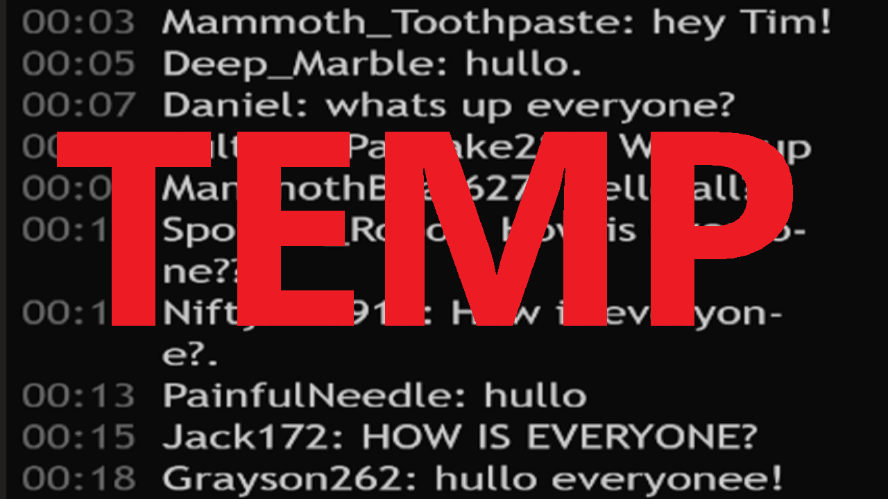

<!--
*** Based on the Best-README-Template: https://github.com/othneildrew/Best-README-Template
***
*** To avoid retyping too much info. Do a search and replace for the following:
*** repo_name, project_title, project_description
-->


<!-- PROJECT SHIELDS -->
<!-- [![Release][release-shield]][release-url] -->
<!-- [![Last Commit][last-commit-shield]][last-commit-url] -->
<!-- [![Contributors][contributors-shield]][contributors-url] -->
<!-- [![Forks][forks-shield]][forks-url] -->
<!-- [![Stargazers][stars-shield]][stars-url] -->
<!-- [![Issues][issues-shield]][issues-url] -->
<!-- [![MIT License][license-shield]][license-url] -->
<!-- [![LinkedIn][linkedin-shield]][linkedin-url] -->


<!-- PROJECT LOGO -->
<br />
<p align="center">
  <a href="https://github.com/Tim-W-James/JavaScript-Interactive-Procedural-Text-Experience/blob/master/thumbnail.png">
    
  </a>

  <h2 align="center">JavaScript Interactive Procedural Text Experience</h2>

  <p align="center">
    A JavaScript interactive art piece that lets players create their own pictures in front of a simulated live audience.
    <br />
    This project was created during my university studies at ANU in <b>2019</b> and has been transferred from the <b>ANU GitLab</b> server.
    <br />
<!--     <a href="https://github.com/Tim-W-James/repo_name"><strong>Explore the docs »</strong></a>
    <br /> 
    <br /> -->
<!--     <a href="https://github.com/Tim-W-James/repo_name">View Demo</a> -->
<!--     ·
    <a href="https://github.com/Tim-W-James/repo_name/issues">Report Bug</a> -->
<!--     ·
    <a href="https://github.com/Tim-W-James/repo_name/issues">Request Feature</a> -->
  </p>
</p>


<!-- TABLE OF CONTENTS -->
<details open="open">
  <summary>Table of Contents</summary>
  <ol>
    <li>
      <a href="#about-the-project">About The Project</a>
      <ul>
        <li><a href="#built-with">Built With</a></li>
      </ul>
    </li>
    <li>
      <a href="#getting-started">Getting Started</a>
      <ul>
<!--         <li><a href="#prerequisites">Prerequisites</a></li> -->
        <li><a href="#installation">Installation</a></li>
      </ul> 
    </li>
<!--     <li>
        <a href="#usage">Usage</a>
        <ul>
        <li><a href="#example-usecases">Example Usecases</a></li>
        </ul>
    </li> -->
<!--     <li><a href="#roadmap">Roadmap</a></li> -->
<!--     <li><a href="#contributing">Contributing</a></li> -->
<!--     <li><a href="#license">License</a></li> -->
    <li><a href="#contact">Contact</a></li>
<!--     <li><a href="#acknowledgements">Acknowledgements</a></li> -->
  </ol>
</details>


<!-- ABOUT THE PROJECT -->
## About The Project

[![Screen Shot][product-screenshot]](https://github.com/Tim-W-James/JavaScript-Interactive-Procedural-Text-Experience)

A JavaScript interactive experience where players create their own pictures in front of a simulated live audience that reacts to the decisions of the player. The project is part of the course COMP1720 at ANU, and a showcase can be found [here](https://comp1720.cecs.anu.edu.au/u6947396/comp1720-2019-major-project/). Read the [artist statement](https://github.com/Tim-W-James/JavaScript-Interactive-Procedural-Text-Experience/blob/master/artist-statement.md) for the thinking behind the project.

### Built With

* JavaScript
* p5.js

<!-- GETTING STARTED -->
## Getting Started

### Prerequisites

Visual Studio Code with the following [extensions](https://marketplace.visualstudio.com/items?itemName=anucecsit.comp1720-extension-pack):
* Live Server
* p5.js Snippets
* YAML

### Installation

1. Clone the repo
   ```sh
   git clone https://github.com/Tim-W-James/JavaScript-Interactive-Desktop-Sim
   ```
2. Run live server ("Go Live" in lower right)


<!-- LICENSE -->
<!-- ## License -->

<!-- Distributed under the MIT License. See `LICENSE` for more information. -->


<!-- CONTACT -->
## Contact

Email: [tim.jameswork9800@gmail.com](mailto:tim.jameswork9800@gmail.com "tim.jameswork9800@gmail.com")

Project Link: [https://github.com/Tim-W-James/JavaScript-Interactive-Procedural-Text-Experience](https://github.com/Tim-W-James/JavaScript-Interactive-Procedural-Text-Experience)


<!-- ACKNOWLEDGEMENTS -->
## Acknowledgements

* Australian National University for VSCode framework and project skeleton

[product-screenshot]: jsInteractive1.png

<!-- USEFUL LINKS FOR MARKDOWN
* https://www.markdownguide.org/basic-syntax
* https://www.webpagefx.com/tools/emoji-cheat-sheet
* https://shields.io
* https://choosealicense.com
* https://pages.github.com
* https://daneden.github.io/animate.css
* https://connoratherton.com/loaders
* https://kenwheeler.github.io/slick
* https://github.com/cferdinandi/smooth-scroll
* http://leafo.net/sticky-kit
* http://jvectormap.com
* https://fontawesome.com -->
